# Little Linux Helper

## Beschreibung


Little Linux Helper ist eine umfassende Sammlung von Bash-Skripten, die darauf ausgelegt ist, unterschiedliche Aufgaben der Systemadministration, Diagnose und Wartung unter Linux zu vereinfachen. Es bietet sowohl ein klassisches menügeführtes Kommandozeilen-Interface als auch eine moderne, webbasierte GUI, um bequem auf zahlreiche Werkzeuge und Funktionen zuzugreifen.

Ausführlichere technische Dokumentation (auf Englisch) zu einzelnen Modulen und Kernkomponenten findest du im Verzeichnis `docs`.
Die Datei `docs/CLI_DEVELOPER_GUIDE.md` enthält alle Informationen zu `lib/lib_common.sh` und `help_master.sh`, die du zum Erstellen eines neuen Moduls benötigst.
Hinweis: Die ursprüngliche `lib_common.sh` wurde zur besseren Strukturierung in mehrere spezialisierte Bibliotheken aufgeteilt (z. B. `lib_colors.sh`, `lib_i18n.sh`, `lib_notifications.sh` usw.). `lib_common.sh` bleibt jedoch der zentrale Einstiegspunkt und lädt automatisch alle weiteren Kernbibliotheken. Zusätzlich ist `lib_btrfs.sh` eine spezialisierte Bibliothek, die ausschließlich von BTRFS-Modulen verwendet wird und nicht Teil des Kern-Bibliothekssystems ist.

Meine Arbeitsumgebung basiert in der Regel auf Arch (Hauptsystem) oder Debian (verschiedene Dienste auf meinem Proxmox – daher die Docker-Komponenten). Entsprechend kann es auf anderen Distributionen unbekannte Probleme geben, auch wenn ich versuche, alles kompatibel zu halten.

<br clear="right">

> **🎯 Projektstatus:**
> - **Dokumentation**: Umfassende technische Dokumentation ist im Verzeichnis `docs/` für alle Module und Kernkomponenten verfügbar
> - **GUI-Interface**: Vollständige Internationalisierung (Englisch/Deutsch) mit fehlertolerantem Übersetzungssystem und umfangreichen Hilfetexten
> - **BTRFS-Module**: Erweiterte BTRFS-Backup- und -Restore-Module mit atomaren Operationen, inkrementellen Backup-Ketten und umfassenden Sicherheitsmechanismen
> - **Modulare Architektur**: Klare Trennung der Backup-Typen in spezialisierte Module (BTRFS, TAR, RSYNC) mit einheitlicher Dispatcher-Schnittstelle
> - **Session Awareness**: Erweiterte Sitzungsregistrierung mit intelligenter Konflikterkennung und Sperrkategorien, um gefährliche Paralleloperationen zu verhindern
> - **Teststatus**: Backup-Funktionen sind gut getestet und stabil; Restore-Funktionen sind implementiert, benötigen aber vor Produktionseinsatz umfangreiche Tests
> - **Update**: Das BTRFS-Backup-Modul muss (erneut) getestet werden

<details>
<summary>⚠️ Wichtige Hinweise zur Nutzung</summary>

**Bitte beachte die folgenden Punkte sorgfältig, bevor du die Skripte aus diesem Repository verwendest:**

* **Kein professioneller Programmierer:** Ich bin eigentlich kein Programmierer. Diese Skripte sind als Hobbyprojekt und zur Vereinfachung entstanden. Sie können daher suboptimale Ansätze, Fehler oder ineffiziente Methoden enthalten.
* **Nutzung auf eigene Gefahr:** Die Verwendung der hier bereitgestellten Skripte erfolgt ausschließlich auf eigene Gefahr. Ich übernehme keinerlei Verantwortung oder Haftung für mögliche Datenverluste, Systeminstabilitäten, Schäden an Hard- oder Software oder sonstige direkte oder indirekte Folgen, die aus der Nutzung dieser Skripte resultieren könnten. Es wird dringend empfohlen, vor kritischen Operationen immer Sicherungen wichtiger Daten und des Systems anzulegen.
* **KI-generierte Inhalte:** Ein erheblicher Teil der Skripte und der begleitenden Dokumentation wurde mithilfe Künstlicher Intelligenz (KI) erstellt. Obwohl ich versucht habe, die Funktionalität zu testen und die Informationen zu prüfen, können die Skripte Fehler, unerwartetes Verhalten oder logische Mängel enthalten, die auf den KI-Generierungsprozess zurückzuführen sind. Sei dir dessen bewusst und prüfe den Code kritisch, bevor du ihn einsetzt – insbesondere in produktiven oder sensiblen Umgebungen.

</details>

## Lizenz

Dieses Projekt steht unter der MIT-Lizenz. Weitere Informationen findest du in der Datei `LICENSE` im Projektstammverzeichnis.

<details>
<summary>❗ Bekannte Probleme und Einschränkungen</summary>

Hier findest du eine Liste bekannter Probleme, Einschränkungen oder Verhaltensweisen, die beim Einsatz der Skripte auftreten können.

* **Systemkompatibilität:**
    * Hauptsächliche Testumgebung: Arch Linux (Hauptsystem) und Debian (Proxmox-Dienste)
    * Auf anderen Distributionen kann es zu unbekannten Kompatibilitätsproblemen kommen, obwohl die Skripte auf breite Kompatibilität ausgelegt sind
    * Einige Funktionen erfordern spezifische Paketmanager oder Systemwerkzeuge

* **Erweiterte Log-Analyse (`scripts/advanced_log_analyzer.py`):**
    * Bekannte Einschränkungen bei der Erkennung von Logformaten und Zeichencodierungen
    * Komplexe reguläre Ausdrücke decken nicht alle Logvarianten ab
    * Siehe `docs/tools/doc_advanced_log_analyzer.md` für detaillierte Einschränkungen und Nutzungshinweise

* **Modulspezifische Einschränkungen:**
    * **BTRFS-Operationen**: Erfordern ein BTRFS-Dateisystem und entsprechende Berechtigungen
    * **Docker-Sicherheit**: Tiefe und Genauigkeit der Scans hängen von der Komplexität der Compose-Dateien ab
    * **Hardware-Monitoring**: Temperatursensoren benötigen `lm-sensors` und passende Hardwareunterstützung

</details>

## Funktionen

Das Projekt bietet zwei Oberflächen, um auf die Funktionen zuzugreifen:

### 🖥️ **Kommandozeileninterface (CLI)**
Das Hauptskript `help_master.sh` dient als zentraler Einstiegspunkt in die CLI und stellt über ein klassisches, menügeführtes Interface Zugriff auf alle Module bereit.

### 🌐 **Grafische Benutzeroberfläche (GUI)**
Eine moderne webbasierte GUI kann über `gui_launcher.sh` gestartet werden und bietet:
- **Weboberfläche**: Modernes React-Frontend mit responsivem Design, aufrufbar im Webbrowser
- **Multi-Session-Unterstützung**: Unbegrenzte parallele Modulsitzungen mit Sitzungsverwaltung im Dropdown
- **Echtzeit-Terminal**: Integrierte Terminalanzeige mit ANSI-Farbunterstützung und interaktiver Eingabeverarbeitung
- **Erweiterte Sitzungsverwaltung**: Sitzungswechsel, Statusindikatoren, Output-Erhalt und individuelle Sitzungssteuerung
- **Modulnavigation**: Kategorisierte Seitenleiste mit einzelnen „Start“-Buttons und intuitiver Modulauswahl (ausblendbar)
- **Erweitertes Dokumentationssystem**: Dualer Dokumentationsmodus mit modulgebundenen Docs und eigenständigem Dokumentbrowser
- **Dokumentenbrowser**: Kategorisierte Navigation durch alle Dokumentationen mit einklappbaren Gruppen und Suche
- **Panel-Steuerungssystem**: Sidebar, Terminalpanels, Hilfe und Dokumentation flexibel ein- und ausblendbar für optimale Lesbarkeit
- **Vollbild-Lesemodus**: Blendet alle Panels außer der Dokumentation aus, um maximalen Leseraum zu schaffen
- **Mehrfach-Panel-Layout**: Skalierbare Panels mit flexiblen Ein-/Ausblendoptionen für eine optimale Arbeitsfläche
- **Sicherheitsfunktionen**: Standardmäßig nur an `localhost` gebunden, optionaler Netzwerkzugriff per Kommandozeile
- **Konfigurierbares Netzwerk**: Port- und Host-Konfiguration über `config/general.conf` oder Kommandozeilenargumente
- **Internationalisierung**: Vollständige Englisch/Deutsch-Übersetzungen mit dynamischem Sprachwechsel
- **Fehlertolerantes Design**: Fehlende Übersetzungsschlüssel zeigen Fallback-Inhalte anstatt Abstürze zu verursachen
- **Umfassendes Hilfesystem**: Kontextsensitive Hilfe mit detaillierten Modulhinweisen und Nutzungsempfehlungen
- **Erweiterte Funktionen**: PTY-Integration für echtes Terminalgefühl und WebSocket-Kommunikation für Echtzeit-Updates

> **🌐 Internationalisierung:** Die GUI unterstützt vollständige Englisch/Deutsch-Übersetzungen mit dynamischem Sprachwechsel und automatischer Sprachvererbung von der CLI.

<details>
<summary>GUI-Konfiguration & Nutzung:</summary>

```bash
# GUI-Launcher (empfohlen):
./gui_launcher.sh              # Standard: sicheres localhost-Binding
./gui_launcher.sh -n           # Netzwerkzugriff aktivieren (-n Kurzform)
./gui_launcher.sh -n -f        # Netzwerkzugriff mit Firewall-Portöffnung
./gui_launcher.sh -p 8080      # Benutzerdefinierter Port (Kurzform)
./gui_launcher.sh --port 8080  # Benutzerdefinierter Port (Langform)
./gui_launcher.sh -n -p 80 -f  # Netzwerkzugriff auf benutzerdefiniertem Port mit Firewall
./gui_launcher.sh -b -n        # Bauen und starten mit Netzwerkzugriff
./gui_launcher.sh -h           # Umfassende Hilfe

# Individuelle Konfiguration über config/general.conf:
CFG_LH_GUI_PORT="3000"        # Standard-Port festlegen
CFG_LH_GUI_HOST="localhost"   # Binding setzen (localhost/0.0.0.0)
CFG_LH_GUI_FIREWALL_RESTRICTION="local"  # IP-Beschränkungen für Firewallöffnung

# Direkter Binary-Aufruf (Fortgeschrittene):
./gui/little-linux-helper-gui -p 8080         # Benutzerdefinierter Port (Kurzform)
./gui/little-linux-helper-gui --port 8080     # Benutzerdefinierter Port (Langform)
./gui/little-linux-helper-gui -n              # Netzwerkzugriff aktivieren (-n Kurzform)
./gui/little-linux-helper-gui --network -p 80 # Netzwerkzugriff auf Port 80
./gui/little-linux-helper-gui -h              # Hilfe anzeigen (Kurzform)
./gui/little-linux-helper-gui --help          # Hilfe anzeigen (Langform)
```

Die GUI bleibt vollständig kompatibel mit sämtlicher CLI-Funktionalität und bietet gleichzeitig eine moderne Nutzererfahrung mit leistungsstarker Multisession-Unterstützung sowie **vollständiger Internationalisierung (Englisch/Deutsch)** inklusive dynamischem Sprachwechsel.

</details>

---

Beide Oberflächen bieten Zugriff auf die folgenden Module:

<details>
<summary>🔄 Wiederherstellungen & Neustarts (<code>mod_restarts.sh</code>)</summary>

* Neustart des Login-Managers (Display Manager).
* Neustart des Soundsystems (PipeWire, PulseAudio, ALSA).
* Neustart der Desktop-Umgebung (KDE, GNOME, XFCE, Cinnamon, MATE, LXDE, LXQt).
* Neustart von Netzwerkdiensten (NetworkManager, systemd-networkd, dhcpcd, systemd-resolved).
* Neustart von Firewall-Diensten (firewalld, UFW, nftables, netfilter-persistent, Shorewall).
* **Session Awareness**: Registriert sich mit Sperrkategorien (`SYSTEM_CRITICAL`) und prüft vor kritischen Aktionen auf Konflikte.

</details>

<details>
<summary>💾 Backup & Wiederherstellung</summary>

* **Einheitlicher Backup-Dispatcher** (`modules/backup/mod_backup.sh`):
    * Zentrale Dispatcher-Schnittstelle für alle Backup-Typen
    * Gemeinsame Konfigurationsverwaltung und Statusberichte für alle Backup-Methoden
    * Umfassender Statusüberblick für BTRFS-, TAR- und RSYNC-Backups
    * **Session Awareness**: Registriert sich mit Sperrkategorien (`FILESYSTEM_WRITE`, `SYSTEM_CRITICAL`), um Konflikte zu vermeiden

* **BTRFS Snapshot Backup & Restore** (`modules/backup/mod_btrfs_backup.sh`, `modules/backup/mod_btrfs_restore.sh`):
    * **Erweiterte Funktionen**: Atomare Backup-Operationen, received_uuid-Schutz, Validierung inkrementeller Ketten
    * **Erweiterte BTRFS-Bibliothek** (`lib/lib_btrfs.sh`): Spezialisierte Bibliothek, die kritische BTRFS-Limitierungen mit echten atomaren Mustern löst
    * **Dynamische Subvolume-Unterstützung**: Erkennt BTRFS-Subvolumes automatisch aus der Systemkonfiguration (`/etc/fstab`, `/proc/mounts`) und unterstützt manuelle Konfiguration für `@`, `@home`, `@var`, `@opt` sowie andere @-präfixierte Subvolumes mit optionaler Quellenbeibehaltung
    * **Inkrementelle Backups**: Intelligente Parent-Erkennung, automatisches Fallback und umfassende Kettenintegritätsprüfung
    * **Restore-Fähigkeiten**: Vollständige Systemwiederherstellung, Wiederherstellung einzelner Subvolumes, Ordner-basierte Wiederherstellung und Bootloader-Integration *(Hinweis: Restore-Funktionen sind implementiert, benötigen aber umfangreiche Tests)*
    * **Sicherheitsfeatures**: Erkennung von Live-Umgebungen, Dateisystem-Gesundheitsprüfungen, Rollback-Funktionen und Dry-Run-Unterstützung
    * **Wartungs-Untermenü**: Dedizierter Bereich für Löschwerkzeuge, Problem-Backup-Bereinigung, Quell-Snapshot-Verwaltung, Prüfung inkrementeller Ketten und Bereinigung verwaister `.receiving_*`-Staging-Snapshots
    * **Detaillierte Dokumentation**: Siehe `docs/mod/doc_btrfs_backup.md`, `docs/mod/doc_btrfs_restore.md` und `docs/lib/doc_btrfs.md`

* **TAR Archiv Backup & Restore** (`modules/backup/mod_backup_tar.sh`, `modules/backup/mod_restore_tar.sh`):
    * **Flexible Backup-Optionen**: Nur Home, Systemkonfiguration, vollständiges System oder benutzerdefinierte Verzeichnisse
    * **Intelligente Ausschlüsse**: Eingebaute System-Ausschlüsse, benutzerkonfigurierbare Muster und interaktive Ausschlussverwaltung
    * **Archivverwaltung**: Komprimierte `.tar.gz`-Archive mit automatischer Bereinigung und Aufbewahrungsrichtlinien
    * **Sichere Wiederherstellung**: Mehrere Zieloptionen mit Sicherheitswarnungen und Bestätigungsabfragen
    * **Session Awareness**: Backup- und Restore-Operationen registrieren sich mit passenden Sperrkategorien
    * **Dokumentation**: Siehe `docs/mod/doc_backup_tar.md` und `docs/mod/doc_restore_tar.md`

* **RSYNC Inkrementelles Backup & Restore** (`modules/backup/mod_backup_rsync.sh`, `modules/backup/mod_restore_rsync.sh`):
    * **Inkrementelle Intelligenz**: Speicher-effiziente Backups mit Hardlink-Optimierung über `--link-dest`
    * **Backup-Typen**: Vollbackups und inkrementelle Backups mit automatischer Parent-Erkennung
    * **Erweiterte Optionen**: Umfassende RSYNC-Konfiguration mit atomaren Operationen und Fortschrittsüberwachung
    * **Flexible Wiederherstellung**: Echtzeit-Fortschrittsanzeige und vollständige Verzeichnisbaum-Wiederherstellung
    * **Session Awareness**: Backup- und Restore-Operationen registrieren sich mit passenden Sperrkategorien
    * **Dokumentation**: Siehe `docs/mod/doc_backup_rsync.md` und `docs/mod/doc_restore_rsync.md`

</details>

<details>
<summary>💻 Systemdiagnose & Analyse</summary>

* **Systeminformationen anzeigen (`mod_system_info.sh`)**:
    * Anzeige von Betriebssystem- und Kernel-Details.
    * CPU-Informationen.
    * RAM-Auslastung und Speicherstatistiken.
    * Auflistung von PCI- und USB-Geräten.
    * Festplattenübersicht (Blockgeräte, Dateisysteme, Mountpunkte).
    * Anzeige der Top-Prozesse nach CPU- und Speicherauslastung.
    * Netzwerkkonfiguration (Schnittstellen, Routen, aktive Verbindungen, Hostname, DNS).
    * Temperaturen und Sensorwerte (erfordert `lm-sensors`).
* **Festplattenwerkzeuge (`mod_disk.sh`)**:
    * Anzeige eingebundener Laufwerke und Blockgeräte.
    * Auslesen von S.M.A.R.T.-Werten (erfordert `smartmontools`).
    * Prüfung von Dateizugriffen auf Ordner (erfordert `lsof`).
    * Analyse der Festplattenbelegung (mit `df` und optional `ncdu`).
    * Testen der Festplattengeschwindigkeit (erfordert `hdparm`).
    * Überprüfung des Dateisystems (erfordert `fsck`).
    * Prüfung des Festplatten-Gesundheitszustands (erfordert `smartmontools`).
    * Anzeige der größten Dateien in einem Verzeichnis.
    * **Session Awareness**: Ressourcenintensive Aktionen registrieren sich mit Sperrkategorien (`RESOURCE_INTENSIVE`).
* **Log-Analyse-Werkzeuge (`mod_logs.sh`)**:
    * Anzeige von Logs der letzten X Minuten (aktueller und vorheriger Boot, erfordert ggf. `journalctl`).
    * Logs eines bestimmten systemd-Dienstes anzeigen (erfordert `journalctl`).
    * Xorg-Logs anzeigen.
    * dmesg-Ausgabe anzeigen und filtern.
    * Paketmanager-Logs anzeigen (unterstützt pacman, apt, dnf, yay).
    * **Erweiterte Log-Analyse (`scripts/advanced_log_analyzer.py`)**:
        * Führt detaillierte Analysen von Logdateien durch (benötigt Python 3, typischerweise als `python3`).
        * Unterstützt Formate wie Syslog, Journald (Text-Export) und Apache (Common/Combined) inklusive automatischer Formaterkennung.
        * Zeigt allgemeine Statistiken (Gesamtanzahl Einträge, Fehleranzahl, Fehlerrate).
        * Listet häufige Fehlermeldungen oder Fehler-Statuscodes auf.
        * Analysiert die zeitliche Verteilung von Logeinträgen (z. B. pro Stunde).
        * Identifiziert Hauptquellen (Programme/Dienste bei Syslog, IP-Adressen bei Apache).
        * Bietet Optionen zur Anpassung der Ausgabe (z.B. Anzahl der Top-Einträge, nur Zusammenfassung, nur Fehler).
        * *Hinweis: Dieses Skript bietet erweiterte Funktionen, sollte aber mit Bedacht und Verständnis seiner Funktionsweise eingesetzt werden – insbesondere unter Berücksichtigung der allgemeinen Projekthinweise.*

</details>

<details>
<summary>🛠️ Wartung & Sicherheit</summary>

* **Paketverwaltung & Updates (`mod_packages.sh`)**:
    * Systemaktualisierungen (unterstützt pacman, apt, dnf, yay).
    * Aktualisierung alternativer Paketmanager (Flatpak, Snap, Nix).
    * Suchen und Entfernen von verwaisten Paketen.
    * Bereinigung des Paket-Caches.
    * Suchen und Installieren von Paketen.
    * Anzeige installierter Pakete (inklusive alternativer Quellen).
    * Anzeige von Paketmanager-Logs.
    * **Session Awareness**: Kritische Aktionen prüfen auf Konflikte mit laufenden Backup-Prozessen.
* **Sicherheitsüberprüfungen (`mod_security.sh`)**:
    * Anzeige offener Netzwerkports (erfordert `ss`, optional `nmap`).
    * Anzeige fehlgeschlagener Anmeldeversuche.
    * System auf Rootkits prüfen (erfordert `rkhunter`, optional `chkrootkit`).
    * Firewall-Status prüfen (UFW, firewalld, iptables).
    * Prüfung auf Sicherheitsupdates.
    * Überprüfung von Passwort-Richtlinien und Benutzerkonten.
    * **Docker-Sicherheitsprüfung**:
        * Analysiert Docker-Compose-Dateien (`docker-compose.yml`, `compose.yml`) auf häufige Sicherheitsrisiken.
        * Suchpfad, Suchtiefe und auszuschließende Verzeichnisse sind konfigurierbar.
        * Bietet eine interaktive Anpassung des Suchpfads, falls der aktuelle Pfad ungültig ist oder geändert werden soll.
        * Führt eine Reihe von Prüfungen durch, darunter:
            * Fehlende Update-Management-Labels (z. B. für Diun, Watchtower).
            * Unsichere Berechtigungen für `.env`-Dateien.
            * Zu offene Berechtigungen für Verzeichnisse mit Compose-Dateien.
            * Verwendung von `:latest`-Tags oder Images ohne spezifische Versionierung (standardmäßig in `config/docker.conf.example` deaktiviert).
            * Konfiguration von Containern mit `privileged: true`.
            * Einbindung kritischer Host-Pfade als Volumes (z. B. `/`, `/etc`, `/var/run/docker.sock`; aktuell nicht in der Zusammenfassung aufgeführt).
            * Auf `0.0.0.0` exponierte Ports, die Dienste für alle Netzwerkschnittstellen öffnen.
            * Verwendung potenziell gefährlicher Linux-Capabilities (z. B. `SYS_ADMIN`, `NET_ADMIN`).
            * Deaktivierte Sicherheitsoptionen wie `apparmor:unconfined` oder `seccomp:unconfined`.
            * Auftreten bekannter Standardpasswörter in Umgebungsvariablen.
            * Direkte Einbettung sensibler Daten (z. B. API-Keys, Tokens) anstelle von Umgebungsvariablen (derzeit nicht zuverlässig).
        * Optional kann eine Liste aktuell laufender Docker-Container angezeigt werden (standardmäßig in `config/docker.conf.example` deaktiviert).
        * Stellt eine Zusammenfassung gefundener potenzieller Probleme mit Handlungsempfehlungen bereit.
    * **Session Awareness**: Rootkit-Scans registrieren sich mit Sperrkategorien (`RESOURCE_INTENSIVE`), um Störungen zu vermeiden.

</details>

<details>
<summary>🐳 Docker-Verwaltung</summary>

* **Docker-Containerverwaltung (`mod_docker.sh`)**:
    * Überwachung und Verwaltung des Container-Status.
    * Anzeige von Docker-Systeminformationen und Ressourcennutzung.
    * Zugriff auf Container-Logs und deren Analyse.
    * Netzwerk- und Volume-Verwaltung.
    * **Session Awareness**: Registriert sich mit Sperrkategorien, um sich mit Systemoperationen abzustimmen.
* **Docker-Setup & Installation (`mod_docker_setup.sh`)**:
    * Automatisierte Docker-Installation über verschiedene Distributionen hinweg.
    * Docker-Compose-Setup und Konfiguration.
    * Benutzerberechtigungen für Docker-Zugriff konfigurieren.
    * Systemdienst-Konfiguration und Start.
    * **Session Awareness**: Installationsvorgänge registrieren sich mit Sperrkategorien (`SYSTEM_CRITICAL`).

</details>

<details>
<summary>🔋 Energieverwaltung & Systemsteuerung</summary>

* **Energieverwaltung (`mod_energy.sh`)**:
    * Verwaltung von Energieprofilen (Performance, Balanced, Power-Saver).
    * Steuerung von Standby/Suspend mit zeitgesteuerter Inhibit-Funktion.
    * Bildschirmhelligkeit anpassen.
    * Schnellaktionen zur Wiederherstellung der Standby-Funktionalität.
    * **Session Awareness**: Registriert sich im Sitzungsregister, um sich mit anderen Systemaktionen abzustimmen.

</details>

<details>
<summary>✨ Spezialfunktionen</summary>

* Sammeln wichtiger Debug-Informationen in einer Datei.

</details>

## GUI-Vorschau

<details>
<summary>GUI-Screenshots durchsuchen</summary>

**Module (Menüreihenfolge)**

<details>
<summary>Dienst- & Desktop-Neustart-Optionen</summary>

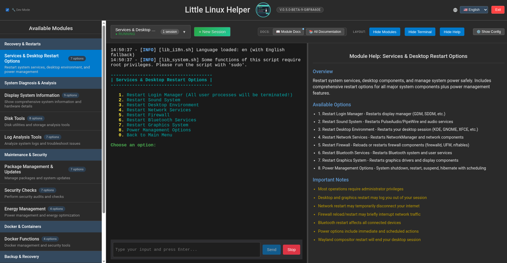

Schneller Zugriff auf Neustarts von Desktop-Umgebungen, Display-Managern und wichtigen Systemdiensten.

</details>

<details>
<summary>Systeminformationen-Modul</summary>

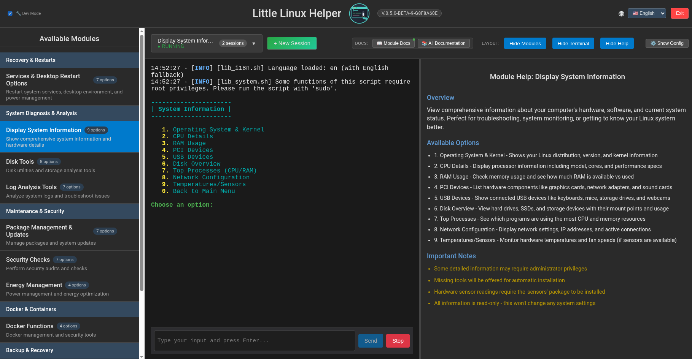

Umfassender Systemüberblick inklusive Hardware-, Kernel- und Netzwerkinformationen.

</details>

<details>
<summary>Festplattenwerkzeuge-Modul</summary>

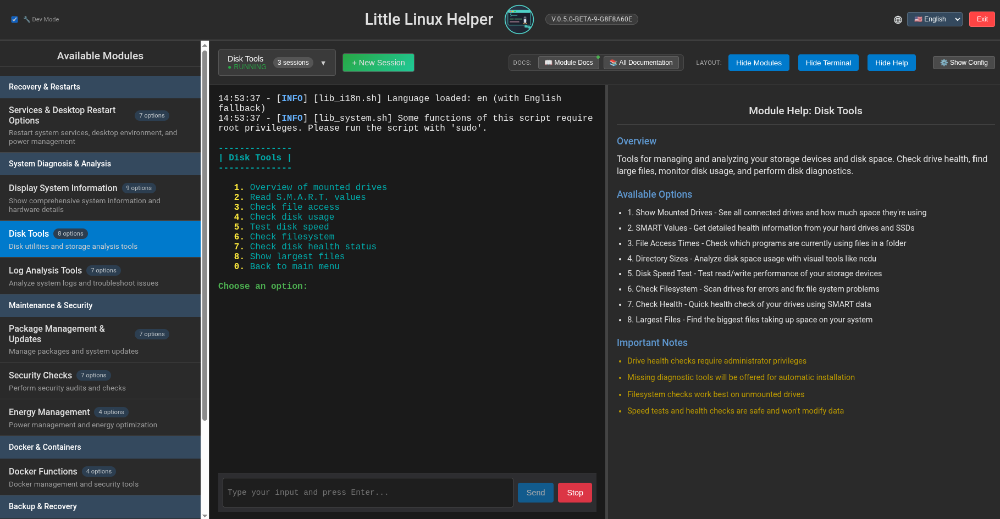

Festplattendiagnose mit SMART-Checks, Belegungsanalyse und Aufräumhilfen.

</details>

<details>
<summary>Log-Analyse-Tools-Modul</summary>

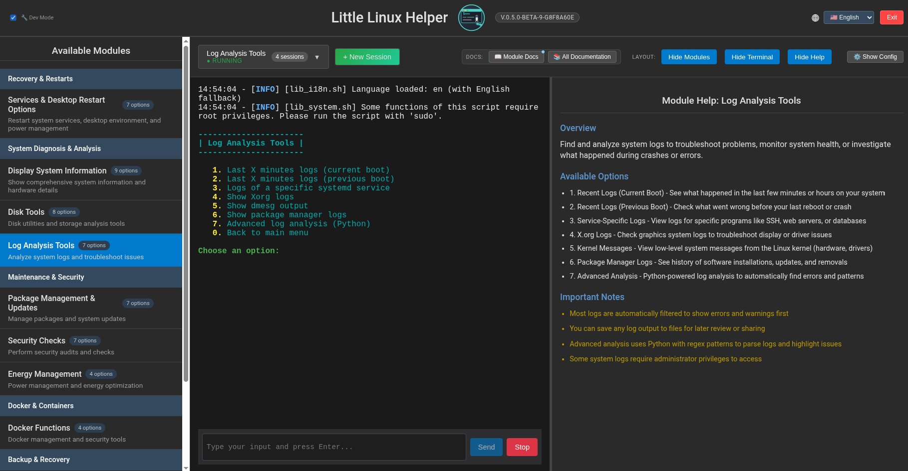

Zentraler Zugriff auf Journalabfragen, Xorg-Logs und den erweiterten Log-Analyzer.

</details>

<details>
<summary>Paketverwaltung & Updates</summary>

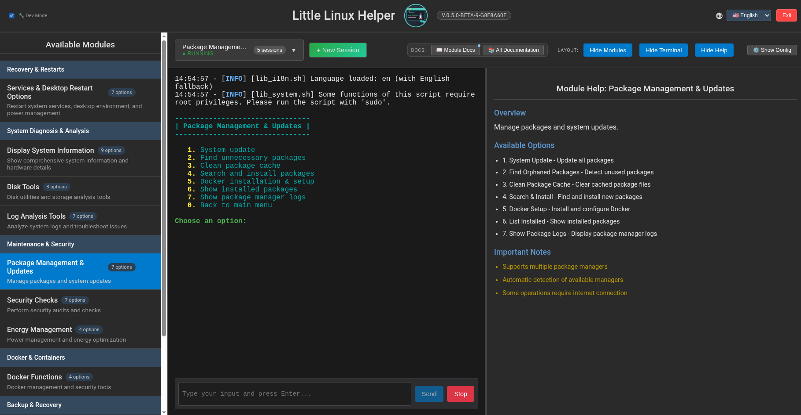

Vereinheitlichte Aktualisierungsprüfungen und Wartungshilfen für Systempakete.

</details>

<details>
<summary>Sicherheitsprüfungen-Modul</summary>

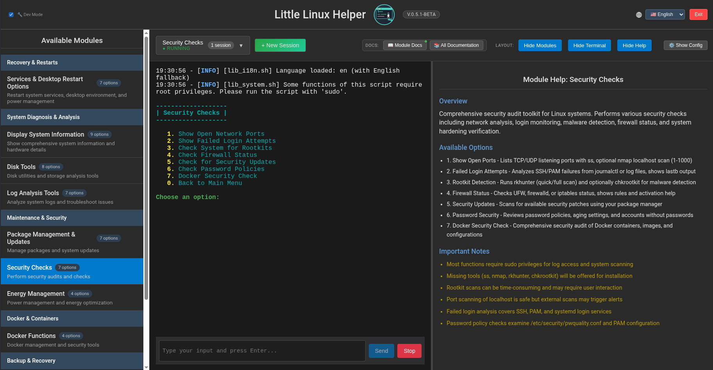

Führt Integritätsprüfungen durch, überprüft Sicherheits-Baselines und bietet Härtungshinweise.

</details>

<details>
<summary>Energieverwaltungs-Modul</summary>

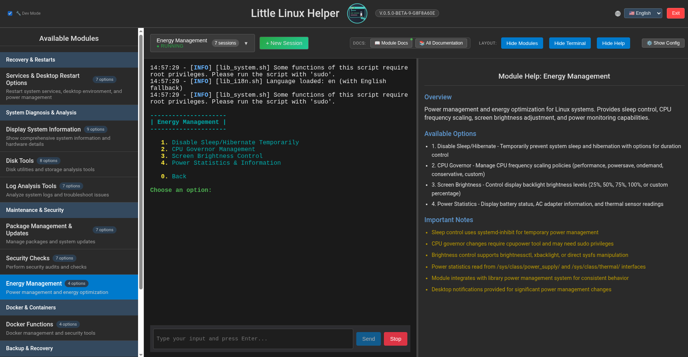

Steuerung von Energieprofilen, Sleep-Inhibit-Timern und Helligkeitseinstellungen.

</details>

<details>
<summary>Docker-Funktionen-Modul</summary>

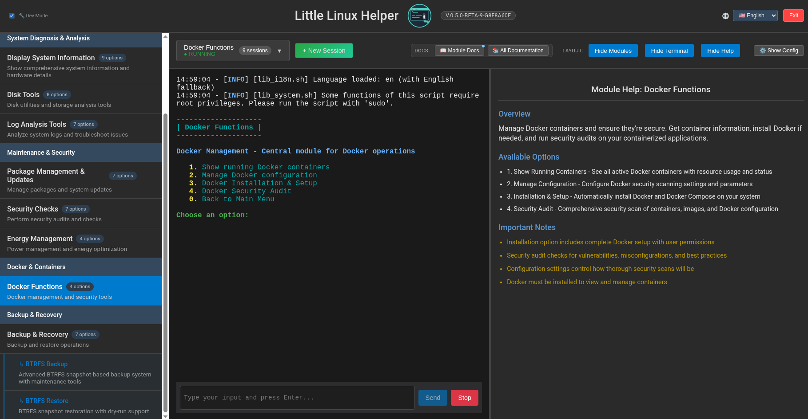

Container-Verwaltungspanel mit Dienststatus, Logs und Ressourcenauswertung.

</details>

<details>
<summary>Backup & Recovery Modul</summary>

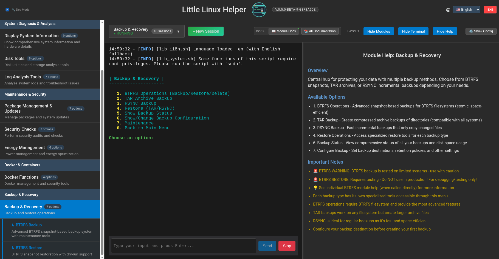

Zentrale Steuerung für BTRFS-, TAR- und RSYNC-Backup- sowie Restore-Workflows.

</details>

<details>
<summary>BTRFS-Backup-Workflow</summary>

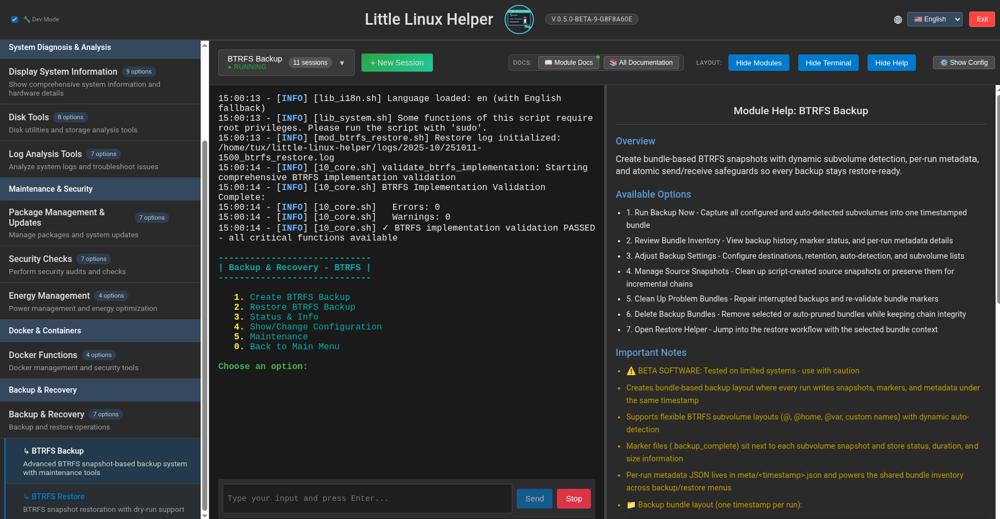

Geführter BTRFS-Backup-Assistent mit Snapshot-Auswahl und Sicherheitsprüfungen.

</details>

<details>
<summary>BTRFS-Restore-Workflow</summary>

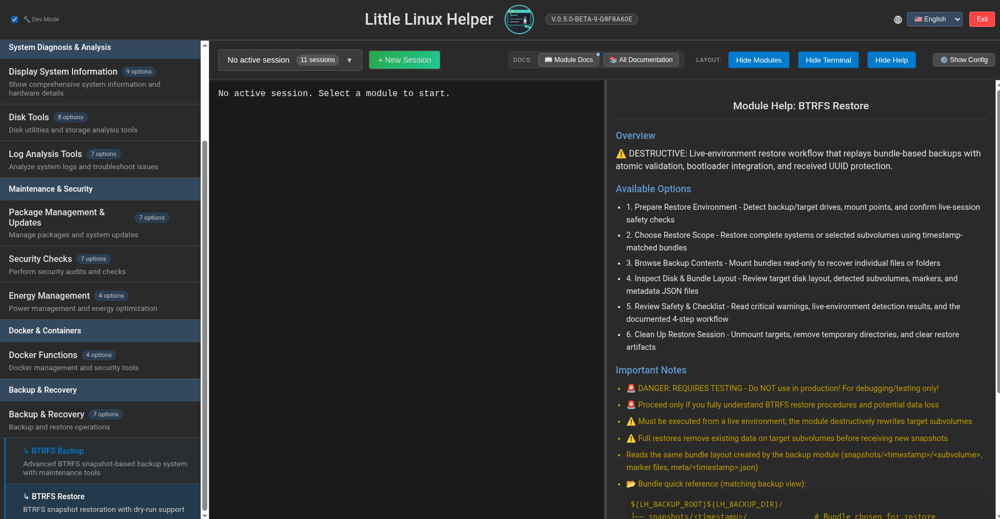

Wiederherstellungsassistent für Komplett-, Subvolume- und Ordner-basierte Restores.

</details>

**Weitere Ansichten**

<details>
<summary>Startseite (Dev-Modus oben links aktiviert)</summary>

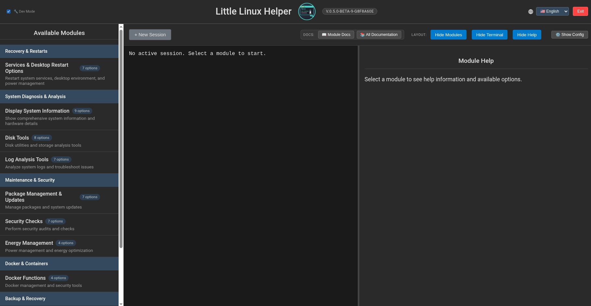

Startseite mit Modulkacheln und Entwickler-Toolbar bei aktivem Dev-Modus.

</details>

<details>
<summary>Übersicht aktive Sitzungen</summary>


Sitzungsumschalter mit parallelen CLI-Sitzungen und Statusindikatoren.

</details>

<details>
<summary>Laufzeit-Konfigurationsdialog</summary>

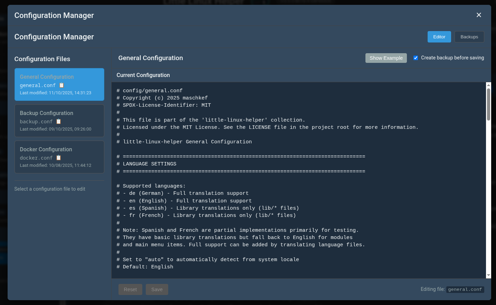

Schnellzugriff auf GUI-Host, Port und Firewall-Optionen während des Betriebs.

</details>

<details>
<summary>Entwickler-Dokumentationsbrowser</summary>

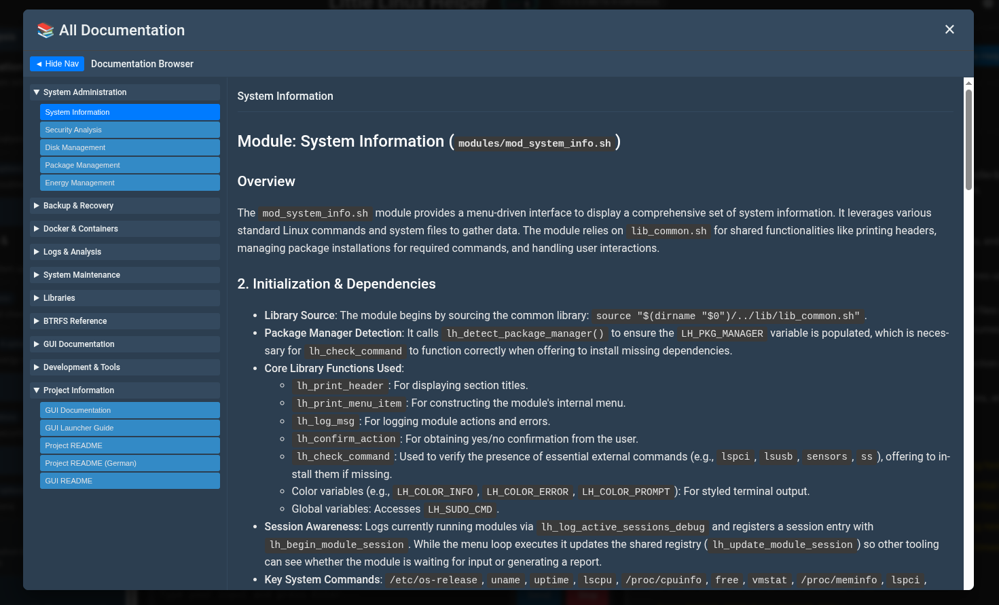

Dokumentations-Hub mit allen Guides und Filtern für eine einfachere Navigation.

</details>

<details>
<summary>Modul-Dokumentationspanel</summary>

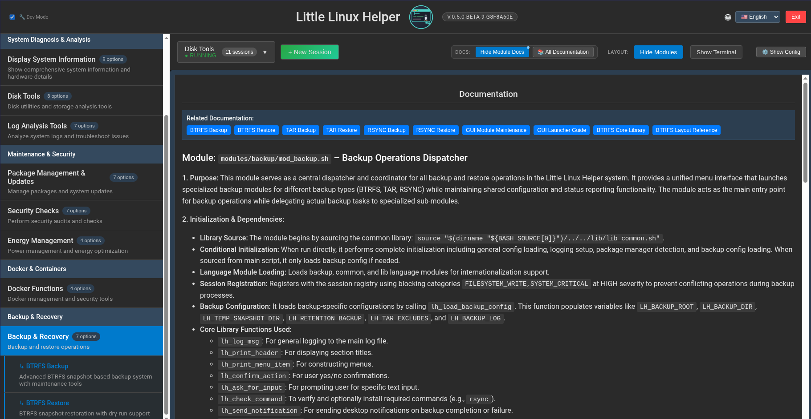

Kontextbezogene Moduldokumentation neben aktiven Sitzungen für schnellen Zugriff.

</details>
</details>

## GUI-Authentifizierung

- **Standardmäßig ist eine Sitzungsanmeldung aktiv.** Beim Start der GUI führt der Browser zur Seite `/login`. Melden Sie sich mit den in `LLH_GUI_USER` und `LLH_GUI_PASS_HASH` hinterlegten Zugangsdaten an, um ein geschütztes Sitzungscookie zu erhalten (CSRF-Schutz und Rate-Limit eingeschlossen).
- **Alternative Modi:** Mit `LLH_GUI_AUTH_MODE=basic` wird HTTP Basic Auth genutzt. `LLH_GUI_AUTH_MODE=none` deaktiviert die Anmeldung **nur** für lokale Bindungen (`127.0.0.1`/`localhost`). Sobald `--network` oder eine andere Adresse verwendet wird, verweigern Launcher und Backend den Start ohne Authentifizierung.
- **Konfigurationsblock** (in `config/general.conf` oder als Umgebungsvariablen setzen):

```bash
export LLH_GUI_AUTH_MODE="session"
export LLH_GUI_USER="admin"
export LLH_GUI_PASS_HASH="$(./gui/little-linux-helper-gui --hash-password 'MeinPasswort')"
export LLH_GUI_COOKIE_NAME="__Host-llh_sess"
export LLH_GUI_COOKIE_SECURE="true"
export LLH_GUI_ALLOWED_ORIGINS=""
```

Mit `--hash-password` erzeugt das GUI-Binary direkt einen passenden bcrypt-Hash. `LLH_GUI_PASS_PLAIN` sollte nur zu Entwicklungszwecken gesetzt werden; der Server warnt beim Start und wandelt den Wert in einen Hash um.

- **Frontend-Helfer:** `utils/api.js` ergänzt alle Fetch-Aufrufe um `credentials: 'same-origin'`, setzt bei unsicheren Methoden automatisch den `X-CSRF-Token`-Header und leitet bei `401`-Antworten nach `/login` um. In der Kopfzeile befindet sich außerdem ein `Logout`-Button, der `POST /api/logout` ausführt.
- **Sicherheitsmaßnahmen:** Helmet-Sicherheitsheader, CSRF-Kontrolle und Login-Rate-Limiting sind standardmäßig aktiv. Sie müssen lediglich Benutzername und Hash hinterlegen – die GUI kümmert sich um den Rest.


## Internationalisierung

<details>
<summary>🌍 Mehrsprachige Unterstützung</summary>

Little Linux Helper unterstützt mehrere Sprachen für die Benutzeroberfläche. Das Internationalisierungssystem sorgt für eine konsistente und benutzerfreundliche Erfahrung in verschiedenen Sprachen.

**Unterstützte Sprachen:**
* **Deutsch (de)**: Vollständige Übersetzungsunterstützung für alle Module
* **Englisch (en)**: Vollständige Übersetzungsunterstützung für alle Module (Standardsprache und Fallback)
* **Spanisch (es)**: Nur vereinzelte interne Übersetzungen (Logeinträge etc.), praktisch unbrauchbar
* **Französisch (fr)**: Nur vereinzelte interne Übersetzungen (Logeinträge etc.), praktisch unbrauchbar

**Sprachauswahl:**
* **Automatische Erkennung**: Die Systemsprache wird automatisch über die Umgebungsvariablen (`LANG`, `LC_ALL`, `LC_MESSAGES`) ermittelt
* **Manuelle Konfiguration**: Die Sprache kann in `config/general.conf` über die Einstellung `CFG_LH_LANG` festgelegt werden
* **Fallback-Mechanismus**: Bei fehlenden Übersetzungen oder nicht unterstützten Sprachen fällt das System automatisch auf Englisch zurück

**Sprachkonfiguration:**
```bash
# In config/general.conf
CFG_LH_LANG="auto"    # Automatische Systemsprache
CFG_LH_LANG="de"      # Deutsch
CFG_LH_LANG="en"      # Englisch
CFG_LH_LANG="es"      # Spanisch (praktisch unbrauchbar, nur interne Meldungen)
CFG_LH_LANG="fr"      # Französisch (praktisch unbrauchbar, nur interne Meldungen)
```

**Technische Details:**
* Sämtliche Benutzertexte werden über das `lh_msg()`-System abgerufen
* Übersetzungsdateien befinden sich im Verzeichnis `lang/`, organisiert nach Sprachcodes
* Das System lädt zuerst Englisch als Fallback-Basis und überschreibt anschließend mit der gewünschten Sprache
* Fehlende Übersetzungsschlüssel werden automatisch protokolliert und als `[KEY]` angezeigt

</details>

## Anforderungen

<details>
<summary>📋 Anforderungen</summary>

### Kernanforderungen:
* Bash-Shell
* Standard-Linux-Werkzeuge (z. B. `grep`, `awk`, `sed`, `find`, `df`, `lsblk`, `ip`, `ps`, `free`, `tar`, `rsync`, `btrfs-progs` usw.)
* Manche Funktionen erfordern Root-Rechte und nutzen bei Bedarf `sudo`

### GUI-Anforderungen (optional):
* **Go** (1.18 oder neuer) für die Backend-Kompilierung
* **Node.js** (16 oder neuer) und **npm** für Frontend-Entwicklung und -Build
* **Webbrowser** für den Zugriff auf die GUI
* Zusätzliche Systemabhängigkeiten: `github.com/gofiber/fiber/v2`, `github.com/gofiber/websocket/v2`, `github.com/creack/pty` (werden automatisch installiert)

### Optionale Abhängigkeiten:
Für bestimmte Funktionen werden zusätzliche Pakete benötigt, die das Skript bei Bedarf zu installieren versucht:
    * `btrfs-progs` (für BTRFS Backup/Restore)
    * `rsync` (für RSYNC Backup/Restore)
    * `smartmontools` (für S.M.A.R.T.-Werte und Festplattenzustand)
    * `lsof` (für die Prüfung von Dateizugriffen)
    * `hdparm` (für Festplattengeschwindigkeitstests)
    * `ncdu` (für interaktive Festplattenanalyse, optional)
    * `util-linux` (enthält `fsck`)
    * `iproute2` (enthält `ss`)
    * `rkhunter` (für Rootkit-Prüfungen)
    * `chkrootkit` (optional, für zusätzliche Rootkit-Prüfungen)
    * `lm-sensors` (für Temperatur- und Sensorwerte)
    * `nmap` (optional, für lokale Port-Scans)
    * **Desktop-Benachrichtigungen:** `libnotify` (stellt `notify-send` bereit), `zenity` oder `kdialog`
    * Python 3 (typischerweise als `python` oder `python3`; für die erweiterte Log-Analyse)
    * `pacman-contrib` (für `paccache` auf Arch-basierten Systemen, falls nicht vorhanden)
    * `expac` (für kürzlich installierte Pakete auf Arch-basierten Systemen)

Das Skript versucht automatisch, den verwendeten Paketmanager (pacman, yay, apt, dnf) zu erkennen. Alternative Paketmanager wie Flatpak, Snap, Nix und AppImage werden ebenfalls berücksichtigt.

</details>

## Installation & Setup

<details>
<summary>🚀 Installation & Setup</summary>

### 📦 **Vorkompilierte Releases (empfohlen)**

**Seit v0.4.0 stehen vorkompilierte GUI-Releases zur Verfügung**, wodurch Node.js/npm auf den Zielsystemen nicht mehr erforderlich ist:

#### Schnellinstallation:
```bash
# Automatischen Installer herunterladen und ausführen
curl -L https://raw.githubusercontent.com/maschkef/little-linux-helper/main/install-prebuilt.sh | sudo bash
```

#### Manueller Download:
1. Besuche die [GitHub Releases](https://github.com/maschkef/little-linux-helper/releases)
2. Lade das Paket für deine Architektur herunter:
   - **AMD64** – Die meisten modernen 64-Bit-Systeme (Intel/AMD)
   - **ARM64** – Raspberry Pi 4, moderne ARM-Server
   - **ARMv7** – Raspberry Pi 2/3, ältere ARM-Geräte
3. Entpacken und starten:
   ```bash
   tar -xzf little-linux-helper-gui-<arch>.tar.gz
   cd little-linux-helper-gui-<arch>
   ./gui_launcher.sh
   ```

**Systemanforderungen (vorkompiliert):**
- Beliebige Linux-Distribution
- Kein Node.js, npm oder Go erforderlich
- Sofort einsatzbereit

#### 📋 **GUI-Launcher vs. Direktes Binary**

**Empfohlen: `./gui_launcher.sh` verwenden**
- ✅ **Vollständiger Funktionsumfang**: Build-Management, erweiterte Firewall-Konfiguration, Sicherheitswarnungen
- ✅ **Bibliotheksintegration**: Farben, i18n, Logging, Konfigurationsmanagement  
- ✅ **Interaktive Firewall-Einrichtung**: Automatische Netzwerkerkennung, IP-Beschränkungen
- ✅ **Sicherheitsfunktionen**: Umfassende Warnungen für Netzwerkzugriff und erhöhte Privilegien
- ✅ **Build-Automatisierung**: Automatische Abhängigkeitsprüfung und GUI-Build bei Bedarf

**Fortgeschritten: Direkt `./gui/little-linux-helper-gui`**
- ⚠️  **Nur Grundfunktionen**: Einfacher Serverstart mit minimalen Features
- ⚠️  **Kein Build-Management**: Manuelles Bauen erforderlich, falls nötig
- ⚠️  **Keine Firewall-Integration**: Manuelle Konfiguration notwendig
- ✅ **Leichtgewichtig**: Schneller Start für Entwicklung/Tests

#### Warum vorkompilierte Releases?

**Der Wechsel zu automatisierten vorkompilierten Releases löst Kompatibilitätsprobleme:**
- **Problem**: Frühere Versionen verlangten, dass Nutzer die GUI mit `npm install` und `npm run build` selbst bauen
- **Herausforderung**: Moderne Build-Tools (z. B. Vite 7.x) benötigen neuere Node.js-Versionen als in stabilen Distributionen verfügbar
- **Lösung**: GitHub Actions bauen die GUI mit aktuellen Tools und liefern lauffertige Pakete
- **Vorteil**: Maximale Distributionstauglichkeit ohne Verzicht auf moderne Entwicklungswerkzeuge

---

### 🛠️ **Aus dem Quellcode bauen (fortgeschrittene Nutzer)**

#### CLI-Installation:
1. Repository klonen oder Skripte herunterladen.
2. Hauptskript `help_master.sh` ausführbar machen:
    ```bash
    chmod +x help_master.sh
    ```
3. CLI-Interface starten:
    ```bash
    ./help_master.sh
    ```

#### GUI-Selbstbuild (Entwicklung/Fortgeschrittene):
**Hinweis**: In vorkompilierten Releases wird die GUI automatisch gebaut. Selbstbuild ist nur für Entwicklung oder Anpassungen nötig.

**Voraussetzungen:**
* **Go** (1.18 oder neuer) für die Backend-Kompilierung
* **Node.js** (18 oder neuer) und **npm** für Frontend-Entwicklung und -Build
* **Webbrowser** für den Zugriff auf die GUI

**Build-Prozess:**
1. Stelle sicher, dass Go (1.18+) und Node.js (18+) installiert sind.
2. Mache den GUI-Launcher ausführbar:
    ```bash
    chmod +x gui_launcher.sh
    ```
3. Starte die GUI:
    ```bash
    ./gui_launcher.sh
    ```
4. Die GUI erledigt automatisch:
   - Installation benötigter Abhängigkeiten beim ersten Start
   - Build des Frontends, falls erforderlich
   - Start des Webservers auf `http://localhost:3000`
   - Öffnen des Standardbrowsers mit der Oberfläche

**GUI-Entwicklungsmodus:**
Für Entwicklung mit Hot-Reload:
```bash
cd gui/
./setup.sh    # Einmalige Einrichtung
./dev.sh      # Entwicklungsserver starten
```

#### Welche Version solltest du wählen?

| Einsatzszenario | Empfohlene Version | Begründung |
|-----------------|-------------------|------------|
| **Allgemeine Nutzung** | Vorkompiliertes Release (aktuell) | Sofort startbereit, keine Abhängigkeiten, maximale Kompatibilität |
| **Stabile Produktion** | Auf v1.0.0 warten | Derzeit sind alle Releases Pre-Releases/Beta |
| **Entwicklung** | Aus dem Quellcode bauen | Zugriff auf neueste Änderungen, Entwicklertools |
| **Anpassungen** | Aus dem Quellcode bauen | GUI anpassen, eigene Builds |
| **Ältere Systeme** | Vorkompiliertes Release | Kein modernes Node.js/Go auf dem Zielsystem nötig |

**Wichtig**: Die **CLI funktioniert vollständig unabhängig** und läuft auf jedem System mit Bash. Die GUI ist eine optionale Erweiterung, die auf der CLI aufsetzt.

</details>

## Ausführen mit Sudo

<details>
<summary>🔐 Sudo-Nutzung und Dateibesitz</summary>

Little Linux Helper korrigiert automatisch Dateibesitz-Probleme, wenn das Tool mit `sudo` ausgeführt wird. Dadurch behalten Log-, Konfigurations- und Build-Dateien auch mit erhöhten Rechten den richtigen Besitzer.

**Automatische Besitzkorrektur:**
Wird das Tool mit `sudo` gestartet, passiert automatisch:
- Ermittlung des ursprünglichen Benutzers (über die Umgebungsvariable `SUDO_USER`)
- Dateien und Verzeichnisse werden zunächst mit Root-Besitz angelegt (wie bei sudo üblich)
- Der Besitz wird sofort auf den ursprünglichen Benutzer zurückgesetzt
- Die Korrektur erfolgt rekursiv für Verzeichnisse samt Inhalt

**Was korrigiert wird:**
- **Logdateien** im Verzeichnis `logs/`
- **Logverzeichnisse** inklusive monatlicher Unterordner
- **Sitzungsregister** unter `logs/sessions/`
- **Konfigurationsverzeichnisse** und Dateien in `config/`
- **GUI-Build-Artefakte**, wenn mit `sudo` gebaut wird
- **JSON-Ausgabedateien** in temporären Verzeichnissen

**So funktioniert es:**
Die Funktion `lh_fix_ownership()` wird nach dem Erstellen von Dateien oder Verzeichnissen automatisch aufgerufen. Sie:
1. Aktiviert sich nur, wenn als Root via sudo ausgeführt wird (`EUID=0` und `SUDO_USER` gesetzt)
2. Ermittelt UID und GID des ursprünglichen Benutzers
3. Ändert den Besitz rekursiv mittels `chown`
4. Protokolliert den Vorgang auf DEBUG-Level für Transparenz
5. Reagiert fehlertolerant, falls der Besitz nicht angepasst werden kann

**Nutzererfahrung:**
- **Transparent**: Kein Eingreifen des Nutzers nötig
- **Sicher**: Aktiv nur im passenden Kontext (sudo)
- **Leise**: Normale Abläufe zeigen nur DEBUG-Logs
- **Kompatibel**: Funktioniert identisch mit und ohne sudo

**Für Modulentwickler:**
Die Besitzkorrektur wird in den Kernbibliotheken automatisch durchgeführt. Eigene Module benötigen nur dann Sonderbehandlung, wenn Dateien außerhalb der Standardpfade erzeugt werden. In diesem Fall einfach selbst aufrufen:
```bash
mkdir -p "$my_directory"
lh_fix_ownership "$my_directory"
```

**Beispiel:**
```bash
# Ausführen mit sudo – Dateien gehören weiterhin dem ursprünglichen Benutzer
sudo ./help_master.sh
# Logdateien in logs/ gehören automatisch deinem Benutzer, nicht root

# GUI mit sudo bauen – Artefakte gehören dem ursprünglichen Benutzer  
sudo ./gui/build.sh
# Das Binary little-linux-helper-gui und web/build/ gehören deinem Benutzer
```

</details>

## Konfiguration

<details>
<summary>⚙️ Konfigurationsdateien</summary>

Little Linux Helper verwendet Konfigurationsdateien, um bestimmte Verhaltensweisen anzupassen. Diese befinden sich im Verzeichnis `config/`.

Beim ersten Start des Hauptskripts (`help_master.sh`) werden Standardkonfigurationsdateien automatisch angelegt, sofern sie noch nicht existieren. Dafür werden Vorlagendateien mit der Endung `.example` (z. B. `backup.conf.example`) in ihre aktiven Pendants ohne Suffix (z. B. `backup.conf`) kopiert.

**Wichtig:** Wenn eine Konfigurationsdatei erstmals angelegt wird, erhältst du einen Hinweis. Es empfiehlt sich, die frisch erstellten `.conf`-Dateien zu prüfen und bei Bedarf an die eigenen Anforderungen anzupassen.

Konfigurationsdateien werden aktuell für folgende Module verwendet:
* **Allgemeine Einstellungen (`help_master.sh`)**: Sprache, Logging-Verhalten, GUI-Port/Host-Konfiguration und weitere Basiseinstellungen (`config/general.conf`).
* **Backup & Wiederherstellung (`modules/backup/mod_backup.sh`, `modules/backup/mod_btrfs_backup.sh`, `modules/backup/mod_btrfs_restore.sh`)**: Pfade, Aufbewahrungsrichtlinien etc. (`config/backup.conf`).
* **Docker-Sicherheitsprüfung (`mod_security.sh`)**: Suchpfade, zu überspringende Warnungen usw. (`config/docker.conf`).

**GUI-Konfigurationsoptionen:**
Der GUI-Server lässt sich über `config/general.conf` anpassen:
```bash
# GUI-Server-Port (Standard: 3000)
CFG_LH_GUI_PORT="3000"

# GUI-Server-Hostbindung (Standard: localhost aus Sicherheitsgründen)
# Optionen: "localhost" (sicher) oder "0.0.0.0" (Netzwerkzugriff)
CFG_LH_GUI_HOST="localhost"

# Firewall-IP-Beschränkung für den -f-Schalter (Standard: "local")
# Optionen: "all" (alle IPs), "local" (erkannte Netze), spezifische IP/CIDR
CFG_LH_GUI_FIREWALL_RESTRICTION="local"
```

Kommandozeilenargumente (sowohl Kurzform -x als auch Langform --wort) überschreiben Einstellungen aus den Konfigurationsdateien temporär.

</details>

## Modulübersicht

<details>
<summary>📦 Modulübersicht</summary>

Das Projekt ist in Module unterteilt, um die Funktionalität klar zu strukturieren:

* **`lib/lib_common.sh`**: Das Herzstück des Projekts. Enthält zentrale Funktionen, die von allen Modulen verwendet werden, unter anderem:
    * Einheitliches Logging-System.
    * Funktionen zur Befehlsprüfung und automatischen Abhängigkeitsinstallation.
    * Standardisierte Benutzerinteraktionen (Ja/Nein-Abfragen, Eingabeaufforderungen).
    * Erkennung von Systemkomponenten (Paketmanager usw.).
    * Verwaltung farbiger Terminalausgaben für bessere Lesbarkeit.
    * Komplexe Logik zur Ermittlung des aktiven Desktop-Benutzers.
    * Möglichkeit, **Desktop-Benachrichtigungen** an den Benutzer zu senden.
    * **Erweitertes Sitzungsregister**: Intelligentes Session-Tracking mit Sperrkategorien zur Konflikterkennung und -vermeidung.
    * **Kernbibliothekssystem**: Lädt automatisch spezialisierte Bibliotheken (`lib_colors.sh`, `lib_i18n.sh`, `lib_ui.sh` usw.).
* **`lib/lib_btrfs.sh`**: **Spezialisierte BTRFS-Bibliothek** (kein Teil des Kernsystems). Stellt erweiterte BTRFS-Funktionen für atomare Backups, Kettenvalidierung und Sicherheitsmechanismen bereit. Wird ausschließlich von BTRFS-Modulen verwendet und muss explizit eingebunden werden.
* **`modules/mod_restarts.sh`**: Optionen zum Neustart von Diensten und Desktop-Umgebungen.
* **`modules/backup/mod_backup.sh`**: Einheitlicher Backup-Dispatcher mit zentraler Schnittstelle für BTRFS, TAR und RSYNC.
* **`modules/backup/mod_btrfs_backup.sh`**: BTRFS-spezifische Backup-Funktionen (Snapshots, Transfer, Integritätsprüfung, Marker, Bereinigung, Status u. v. m.). Nutzt `lib_btrfs.sh` für erweiterte Operationen.
* **`modules/backup/mod_btrfs_restore.sh`**: BTRFS-Restore-Funktionen (komplettes System, einzelne Subvolumes, Ordner, Dry-Run). Nutzt `lib_btrfs.sh` für atomare Restore-Abläufe.
* **`modules/backup/mod_backup_tar.sh`**: TAR-Backup mit mehreren Typen und intelligentem Ausschluss-Management.
* **`modules/backup/mod_restore_tar.sh`**: TAR-Wiederherstellung mit Sicherheitsfunktionen und flexiblen Zieloptionen.
* **`modules/backup/mod_backup_rsync.sh`**: RSYNC-Inkrementalbackups mit Hardlink-Optimierung und umfangreicher Konfiguration.
* **`modules/backup/mod_restore_rsync.sh`**: RSYNC-Wiederherstellungen mit Echtzeit-Fortschrittsüberwachung und vollständiger Verzeichniswiederherstellung.
* **`modules/mod_system_info.sh`**: Zeigt detaillierte Systeminformationen.
* **`modules/mod_disk.sh`**: Werkzeuge zur Festplattenanalyse und -wartung.
* **`modules/mod_logs.sh`**: Analyse von System- und Anwendungsprotokollen.
* **`modules/mod_packages.sh`**: Paketverwaltung, Systemupdates, Bereinigung.
* **`modules/mod_security.sh`**: Sicherheitsprüfungen, Docker-Sicherheit, Netzwerk, Rootkit-Checks.
* **`modules/mod_docker.sh`**: Docker-Containerverwaltung und -Monitoring.
* **`modules/mod_docker_setup.sh`**: Docker-Installation und Automatisierung.
* **`modules/mod_energy.sh`**: Energie- und Leistungsverwaltung (Profile, Sleep-Steuerung, Helligkeit).

</details>

## Protokollierung

<details>
<summary>📜 Protokollierung</summary>

Alle Aktionen werden protokolliert, um Nachvollziehbarkeit und Fehleranalyse zu erleichtern.

* **Speicherort:** Die Logdateien entstehen im Unterverzeichnis `logs` des Projekts. Für jeden Monat wird ein eigener Unterordner angelegt (z. B. `logs/2025-06`).
* **Dateinamen:** Allgemeine Logs erhalten einen Zeitstempel beim Start des Skripts. Backup- und Restore-Logs werden ebenfalls mit Zeitstempel versehen, um jede Sitzung separat zu erfassen.

</details>

## Kontakt

Bei Fragen, Anregungen oder Problemen mit diesem Projekt kannst du mich gern kontaktieren:

📧 **E-Mail:** [maschkef-git@pm.me](mailto:maschkef-git@pm.me)
